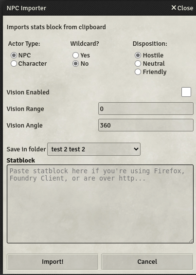

# SWADE NPC Importer

A Savage Worlds Adventure Edition NPC (and PC) stat block importer for [Foundry VTT](https://foundryvtt.com/).

## How to use it...

1. Copy the desired statblock (ctr+c, into the clipboard)
2. Click on the NPC Importer button at the buttom of the **Actors Directory**

    
3. Choose desired options
4. Click Import!

    
5. In case an Actor with the same name already exists, then you have some options
    

## Some configurations

On first use (or, you know, whenever), it is recommended to look at the default settings
    

## How it does it and what's supported

1. The statblock is prased by searching for all supported attributes/traits/etc..
2. Every trait is searched for throughout all Item Compendiums in the selected Package ([see Settings -> Package for Imports](#some-configurations))
3. If the triat is found in a Compendium then it is copied and updated to the Actor; If not found, then a new one will be created for the Actor only (no new compendium entry is created)

### Out-of-the-box supported Attributes & Traits

- **Attributes**
- **Skills**
- **Hindrances**
- **Edges**
- **Powers**
- **Pace**
- **Parry**
- **Toughness**
  - Set to Auto-calculate by default
- **Power Points**
- **Gear**
  - (Equipped by default)
  - Weapons (melee & ranged)
  - Armors
  - Shields
  - Gear
- **Special Abilities**
  - Searching for "Armor" and/or any damage attack (lines with Str. or Str+d*)
  - Size
    - Size influences the tokens' size (bigger than medium) and scale (for smaller than medium)
  - Ignore wounds & Unshake bonuses from: construct, undead, elemental, combat reflexes
  - List them all in the actors' description
    <!-- , adding in-line roll macros where found -->

