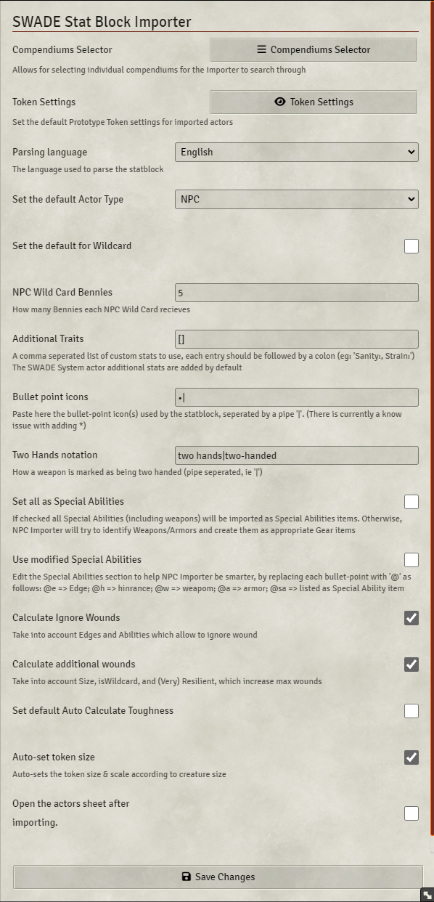

# SWADE NPC Importer

I took this project in order to learn some JavaScript (my day job is C# and some Python; can't say I really like JS that much).  
Mostly, I did it for myself and my friends, but of course you're all welcome to enjoy and use.

Cheers, 
-arnon

---
 

A Savage Worlds Adventure Edition NPC (and PC) stat block importer for [Foundry VTT](https://foundryvtt.com)

## How to use it...
0. Go to [Settings](#some-configurations) and look  around:
   - Under ***Select Item Compendiums*** mark any Compendium you wish NPC Importer to use (not selecting anyting will cycle through all compendiums and use the first relevant entry)
   - Set up any other default values you might want

1. Copy the desired statblock (ctr+c, into the clipboard)
2. Click on the NPC Importer button at the buttom of the **Actors Directory**

    
3. Choose desired options & Click Import!

    
5. In case an Actor with the same name already exists, then you have some options
    

## Some configurations

On first use (or, you know, whenever), it is recommended to look at the default settings

It is highly recommended to choose the Package and/or Item Compendiums you wish NPC Importer to use while importing

## How it does it and what's supported

1. The statblock is prased by searching for all supported attributes/traits/items/etc..
    - Any _Additional Stats (Actors)_ which were added through the SWADE System Settings are: searched for, added, and enabled
    - Traits/Item means: skills, Edges, Hindrances, gear, Powers, etc..
2. Every trait/item is searched for throughout all Item Compendiums in the selected Package (See [NPC Importer Settings](#some-configurations))
3. If the triat/item is found in a Compendium then it is copied and updated to the Actor; If not found, then a new one will be created for the Actor only (no new compendium entry is created)

### Supported Languages
Support is for both the UI and parsing of statblock
- English
- Español (thanks @Montver)
- Português (thanks @lipefl)

(If you wish to add support for more languages, please don't hesitate to create a pull request or open an issue with the file attached)

### Out-of-the-box supported Attributes & Traits

- **Attributes**
- **Skills**
- **Hindrances**
- **Edges**
- **Powers**
- **Pace**
- **Parry**
- **Toughness**
  - Set to Auto-calculate by default
- **Power Points**
- **Gear**
  - (Equipped by default)
  - Weapons (melee & ranged)
  - Armors
  - Shields
  - Gear
- **Special Abilities**
  - Searching for "Armor" and/or any damage attack (lines with Str., Str+d*, or dice formulas)
  - Size
    - Size influences the tokens' size (bigger than medium) and scale (for smaller than medium)
    - Add additional wounds as per the Size Table (SWADE Core)
  - Ignore wounds & Unshake bonuses for: construct, undead, elemental, combat reflexes
  - List them all in the actors' description
  - See [NPC Importer Settings](#some-configurations) for further manipulation of the statblock

