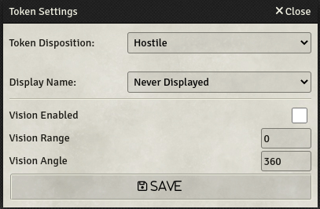

# SWADE NPC Importer

A Savage Worlds Adventure Edition NPC (and PC) stat block importer for [Foundry VTT](https://foundryvtt.com)

---
### :exclamation: **Please Note**

1. If you are running Foundry as self-hosted, and with the HTTP protocol, then the Importer will not be able to read the data from the clipboard (this is security realted stuff). It will usually be represented by the following error in the browser console: `Cannot read property 'readText' of undefined`.

    To solve this either:
      - Set your hosted Foundry to work with HTTPS, or 
      - Set the `Insecure origins treated as secure` flag in your browser (or equivalent) appropriatly ([see here for an explanation](https://github.com/arnonram/swade-npc-importer/issues/42#issuecomment-773385058))

2. ***Firefox*** does not support the `clipboard.readText()` API, and I found not way around this.

:smiley: **The Solution**: The Actor Importer dialog has a text-box into which you may paste the statblock. This will by-pass both of these problems.

---
## How to use it...
0. Go to [Settings](#some-configurations) and look  around:
   - Under ***Select Item Compendiums*** mark any Compendium you wish NPC Importer to use (not selecting anyting will cycle through all compendiums and use the first relevant entry)
   - Set up any other default values you might want

1. Copy the desired statblock (ctr+c, into the clipboard)
2. Click on the NPC Importer button at the buttom of the **Actors Directory**

    
3. Choose desired options & Click Import!

    
5. In case an Actor with the same name already exists, then you have some options
    

## Some configurations

On first use (or, you know, whenever), it is recommended to look at the default settings

It is highly recommended to choose the Package and/or Item Compendiums you wish NPC Importer to use while importing

Some _Prototype Token_ options may be set by default

---
## How it does it and what's supported

1. The statblock is prased by searching for all supported attributes/traits/items/etc..
    - Any _Additional Stats (Actors)_ which were added through the SWADE System Settings are: searched for, added, and enabled
    - Traits/Item means: skills, Edges, Hindrances, Special Abilities, Gear, Powers, etc..
2. Every trait/item is searched for throughout all Item Compendiums in the selected Package (See [NPC Importer Settings](#some-configurations))
3. If the triat/item is found in a Compendium then it is copied and updated to the Actor; If not found, then a new one will be created for the Actor only (no new compendium entry is created)

### What's supported:
- **Attributes**
- **Skills**
  - Core Skills are set according to the SWADE System Settings -> Setting Configurator
- **Hindrances**
- **Edges**
  - Inititate Edges are checked in the _tweaks_ sections of the Actor
- **Powers** & **Power Points**
- **Pace**
- **Parry**
- **Toughness**
  - Set to Auto-calculate to `false` by default
- **Bennies**
  - Bennies are set according to the table below. 
  - ***Note:*** Edges/Hindrances affecting bennies are not taken into account

  |Actor Type |Wild Card  | Max/Current Bennies|
  |:---: | :---: | :---:|
  |NPC| No| 0/0|
  |NPC| Yes| 2/2|
  |Character| No| 0/0|
  |Character| Yes| 3/3|
- **Gear**
  - _Equipped_ by default
  - Weapons (melee & ranged)
    - If weapon does not have Range, then related skill will be *Fighting*
    - If weapon has range, then related skill will be *Shooting*
  - Armors
  - Shields
  - Gear
- **Special Abilities**
  - Search for "Armor" and/or any damage attack (lines with Str., Str+d*, or dice formulas).
    - You may select from the settings to not search for these special items, and then they will all be listed as Special Abilities Items
  - Lists all others as Special Abilities Items
  - Size
    - Size influences the tokens' size (bigger than medium) and scale (for smaller than medium)
    - Add additional wounds as per the Size Table (SWADE Core)
  - Ignore wounds & Unshake bonuses for: construct, undead, elemental, combat reflexes
  - List them all in the actors' description with links to Compendium rules (if using the core-swade Compendium pack)
  - See [NPC Importer Settings](#some-configurations) for further manipulation of the statblock

---
## Supported Languages
Support is for both the UI and parsing of statblock
- English
- Español (thanks @Montver)
- Português (Brasil) (thanks @lipefl)

> ***Please Note:*** I work mainly with English sources, and I do try to test with the supported languages, but, due to the few non-English stat-blocks I have and due to translation quirks, there will be more issus with the non-English. 
My Apologies for that :)

> ***Adding More Languages:*** If you wish to add support for more languages, please don't hesitate to create a pull request or open an issue with the file attached.
